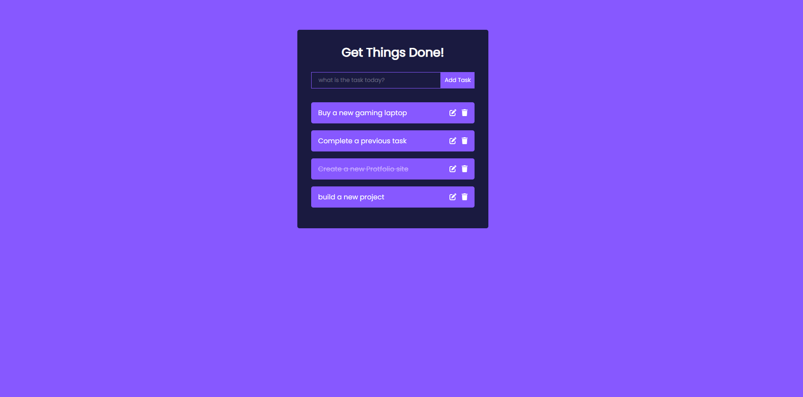

# :tv: ToDo

ToDo is a  List app.

 
:link: Link to the live project: [Link](https://todo-eta-sable.vercel.app/)  
 

 

### Tools:

After designing a prototype of the application using Adobe XD, I started developing the app using the following technologies:

- React. 
- javascript.
- Node.js.

- SCSS modules (CSS grid & CSS Flexbox & Media queries)

